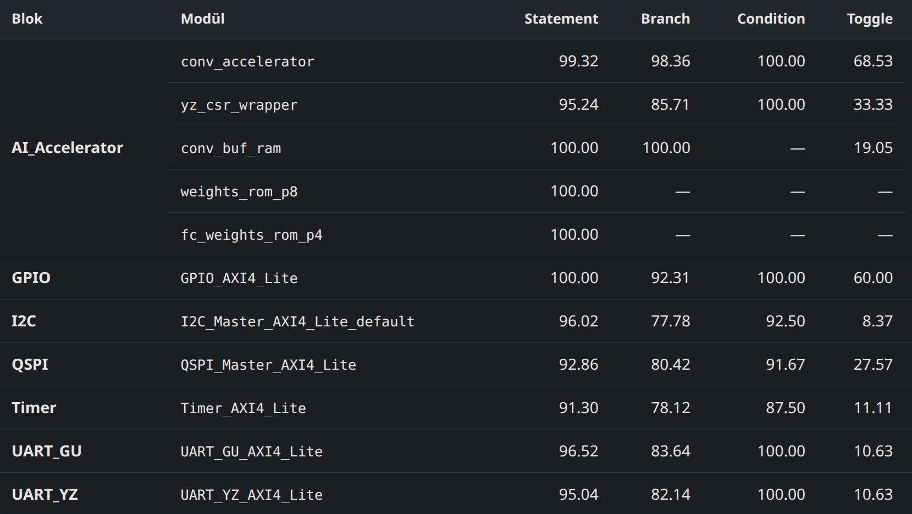
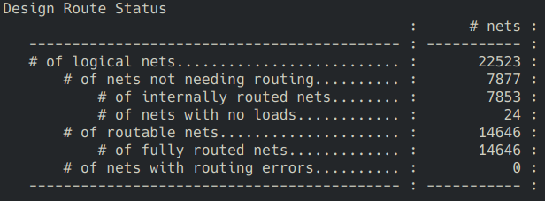
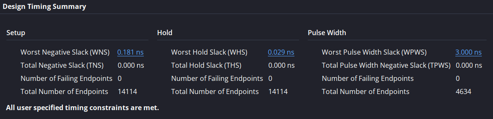
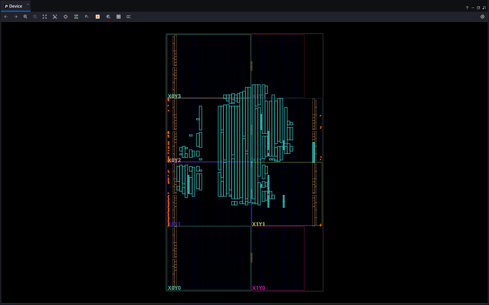

# verification — Doğrulama Sonuçları

Tasarladığımız MCU'nun doğrulama kanıtları. Bu dosya  **özettir**; her doğrulamanın
ayrıntılı açıklaması kendi klasöründeki README'dedir.

Hedef aygıt: **xc7a100tcsg324-1** (Nexys A7), sistem saati **50 MHz**.

---

## Özet

| Doğrulama | Ne kapsıyor | Sonuç | Rapor |
|---|---|---|---|
| Sentez | `fpga_top`, tüm SoC | hatasız | [`vivado_reports/synthesis/`](vivado_reports/synthesis/) |
| Implementasyon | yerleştirme + yollama | hatasız, 14575/14575 net yollandı, 0 hata | [`vivado_reports/implementation/`](vivado_reports/implementation/) |
| Zamanlama | 50 MHz kısıtı | **WNS +0,564 ns**, WHS +0,037 ns, 0 ihlal (14322 uç) | [`vivado_reports/timing_report/`](vivado_reports/timing_report/) |
| Kaynak kullanımı | — | LUT %15,76 · FF %3,56 · BRAM %14,07 · DSP %2,50 ¹ | [`vivado_reports/synthesis/`](vivado_reports/synthesis/) |
| Kod kapsamı | 6 çevre birimi + YZ hızlandırıcı | statement %91–100 | [`vivado_reports/code_coverage/`](vivado_reports/code_coverage/) |
| Directed testbench | 6 çevre birimi + boot zinciri + YZ hızlandırıcı, 8 koşum | **8/8 koşum geçti**, 0 başarısız kontrol | [`vivado_reports/testbench_&_protocol_check/`](vivado_reports/testbench_&_protocol_check/) |
| AXI4-Lite protokol | 15 arayüz, 40 kural, 8 koşum | **0 ihlal** | [`vivado_reports/testbench_&_protocol_check/`](vivado_reports/testbench_&_protocol_check/) |
| UVM regresyon | 7 AXI4-Lite bloğu, 73 test × 3 tohum | **219/219 geçti**, 0 protokol ihlali ² | [`uvm/`](uvm/) |
| UVM fonksiyonel kapsam | covergroup bin'leri | **35/35 ölçülebilir bin → %100** | [`uvm/coverage/`](uvm/coverage/) |
| UVM satır kapsamı | 7 blok, Verilator | **%96,3** (1292/1341 satır) | [`uvm/coverage/`](uvm/coverage/) |
| Spike ISS lockstep | CV32E40P, komut seviyesi | **193/193 komut eşleşti**, 0 fark | [`spike_iss/`](spike_iss/) |
| Boot zinciri | flasher → flash → boot → DMA → INSTRRAM → atlama | **başarılı**, 5 kilometre taşı | [`vivado_reports/testbench_&_protocol_check/Boot/`](vivado_reports/testbench_&_protocol_check/Boot/) |
| YZ — fonksiyonel | 3 sınıf, sistem testi | 3/3 doğru, 45.517 çevrim/çıkarım → **1098,5 çıkarım/s** | [`vivado_reports/testbench_&_protocol_check/AI_Accelerator/`](vivado_reports/testbench_&_protocol_check/AI_Accelerator/) |
| YZ — bellek bütçesi | hızlandırıcının tüm RAM/ROM'ları | **30.720 B = 30,00 KB** (sınır 30 KB) | [`ai_accel_reports/`](ai_accel_reports/) |
| YZ — doğruluk | 156 ses örneği, kart üzerinde | yazılım %91,03 · donanım %91,03 → fark **0,00 puan** | [`ai_accel_reports/`](ai_accel_reports/) |
| YZ — hızlanma | Vivado simülasyonu | **276,9×** (12.608.381 → 45.540 çevrim) | [`ai_accel_reports/`](ai_accel_reports/) |

¹ YZ girdi RAM'i 32.768 → 9.904 bayta indirildikten sonra yeniden sentez
bekliyor; BRAM oranı düşecek.

² Sayıya `gpio_stress_test` dahil değildir: bilerek başarısız olan, bulunan
bir RTL sorununu gösteren tek testtir ([`uvm/findings.md`](uvm/findings.md)).

Şartnamenin iki YZ maddesi de karşılanmıştır: hızlanma sağlanmış, doğruluk farkı
%10'luk pencerenin içinde kalmıştır (mutlak 0,00 puan / bağıl %0,00).

---

## Directed testbench ve AXI protokol doğrulaması

Şartname, çevre birimlerinin ve YZ hızlandırıcının AXI arayüzlerinin **en
azından protocol check düzeyinde** doğrulanmasını, ayrıca bütün çevre
birimlerinin, hızlandırıcının ve MCU üst modülünün **en azından sistem
seviyesinde yönlendirilmiş (directed) testlerle** sınanmasını istiyor
(madde 4.2.2 ve 5.2). Bu iki isterin karşılığı sekiz simülasyon koşumudur.

Altısı **blok seviyesindedir**: her çevre birimi kendi testbench'iyle, elle
yazılmış senaryolar üzerinden sürülür — sayma modları ve olay temizleme
(Timer), 7-segment kod çözme ve tanımsız adres davranışı (GPIO), NACK'te
sessiz iptal (I2C), gerçek Micron flash modeline karşı x1/x2/x4 okuma-yazma
(QSPI), bağımsız TX/RX baud sayaçları (UART'lar). İkisi **sistem
seviyesindedir** ve gerçek firmware koşturur: `boot_test` flasher → QSPI flash →
boot → DMA → Instruction RAM → atlama zincirinin tamamını, `ai_accel_test` ise
UART'tan gelen 1960 baytlık sesin sınıflandırılıp sonucun kesmeyle CPU'ya
dönmesini uçtan uca doğrular.

**Protokol kontrolü ayrı bir koşum değildir.** `axi4lite_protocol_checker`
(10 kategori, 40 kural) her testbench'e `bind` ile bağlıdır ve testin kendi
ürettiği gerçek trafiği canlı denetler. Blok testlerinde yalnızca o bloğun
arayüzü, iki sistem testinde ise `axi4lite_bind.svh` ile **tasarımdaki 15
AXI4-Lite arayüzünün tamamı** izlenir. Kontrolcü trafik görmeyen bir arayüzü
sessizce geçmez, açıkça *"TRAFIK YOK -- bu arayuz HIC test edilmedi"* diye
raporlar; böylece "0 ihlal" ile "hiç sürülmedi" karıştırılamaz.

Bu koşumlar UVM regresyonunun yerine geçmez, onu tamamlar: directed test
senaryoyu elle yazar ("şu register'a şunu yaz, şu olmalı"), UVM ortamı ise aynı
bloklara kısıtlı rastgele trafik sürüp scoreboard'la karşılaştırır. İkisi farklı
hataları yakalar.

Bütün testler self-checking'dir — sonucu elle incelemek gerekmez. Ham konsol
çıktıları, test açıklamaları ve tekrar üretme adımları
[`vivado_reports/testbench_&_protocol_check/`](vivado_reports/testbench_&_protocol_check/)
içindedir; giriş noktası o klasördeki `index.html`.

---

## UVM doğrulaması

Şartname, çevre birimlerinin ve YZ hızlandırıcının AXI4-Lite arayüzlerinin
SystemVerilog + UVM ile doğrulanmasını istiyor. Bunun için yedi bloğa —
altı çevre birimi ve YZ hızlandırıcının CPU'ya bakan CSR arayüzüne — ortak
bir UVM ortamı kuruldu.

Yedi slave de aynı indirgenmiş AXI4-Lite'ı konuşuyor (WSTRB, PROT, ID ve
burst yok; hepsi 1 outstanding ve AW ile W'yi aynı çevrimde bekliyor), bu
yüzden **tek bir AXI agent** hepsine yetiyor: sequencer, sürücü, pasif
monitör ve fonksiyonel kapsam toplayıcı ortaktır. Blok başına değişen şey
`firmware/soc.h`'tan türetilmiş `uvm_reg` modeli, o bloğun yan etkilerini
tarif eden scoreboard ve karşı taraf agent'ıdır: I2C için protokol seviyesinde
bir slave, UART'lar için gerçek baud zamanlamalı bir seri agent, QSPI için
x1/x2/x4 komutları işleyen hafif bir flash responder, GPIO için 7-segment
tarama kurallarını kontrol eden bir pad monitörü, YZ CSR için hızlandırıcı
el sıkışmasını üreten bir taklit.

Mevcut AXI protokol kontrolcüsü (`axi4lite_protocol_checker`, 40 kural)
ortamın içine alındı: her bloğa `bind` ile bağlanıyor ve ihlal sayacı
testin `report_phase`'inde UVM hatasına çevriliyor.

| Blok | Test | Koşum | Geçen | AXI ihlali | Satır kapsamı |
|---|---:|---:|---:|---:|---:|
| GPIO | 9 | 27 | 27 | 0 | %93,4 |
| Timer | 9 | 27 | 27 | 0 | %97,1 |
| UART_GU | 12 | 36 | 36 | 0 | %98,2 |
| UART_YZ | 13 | 39 | 39 | 0 | %98,3 |
| I2C Master | 12 | 36 | 36 | 0 | %97,5 |
| QSPI Master | 11 | 33 | 33 | 0 | %95,0 |
| YZ CSR | 7 | 21 | 21 | 0 | %100,0 |
| **Toplam** | **73** | **219** | **219** | **0** | **%96,3** |

Ortam bir RTL sorunu buldu: **GPIO'nun işlem kabul koşulu kendi
`awready`/`arready`'siyle nitelenmemiş.** Boru hatlı bir master — `VALID`'i
indirmeden ikinci işlemi sunan, AXI'de tamamen yasal bir davranış — bloğu
kilitliyor; tek bir yazma isteğine 10.008 yazma cevabı üretiliyor. Aynı stres
testi diğer altı blokta temiz geçiyor. Ayrıntı ve tekrar üretme adımları
[`uvm/findings.md`](uvm/findings.md)'dedir.

Ayrıca mevcut blok testbench'lerinde hiç bağlanmamış iki yol ilk kez
doğrulandı: UART_YZ'nin DMA yan bandı (`dma_enable_i`/`dma_data_o`/
`dma_valid_o`) ve QSPI'nin DMA register'ı (`0x14`).

Simülatör **Verilator 5.050**, UVM **2020.3.1 (no-DPI)**. Doğrulama kodu
[`../main_codes/testbench/uvm/`](../main_codes/testbench/uvm/), çıktılar ve
ayrıntılı açıklama [`uvm/README.md`](uvm/README.md) içindedir.

---

## Spike ISS doğrulaması

Diğer doğrulamalar tasarımın **sonucuna** bakar: GPIO'ya doğru değer yazıldı mı,
flash'tan okunan uygulama koştu mu, YZ doğru sınıfı buldu mu. Spike ISS
doğrulaması ise CV32E40P'nin **her komutunu** denetler: aynı program hem referans
ISA simülatöründe (Spike, `riscv-isa-sim`) hem RTL'de koşturulur ve iki komut izi
satır satır karşılaştırılır — PC dizisi, komut kodlaması ve register dosyasına
yazılan değerler.

Karşılaştırma **193 komutun tamamında ayrışmasız** tamamlandı.

RTL tarafı çıplak çekirdek değil, **tam SoC**'dur: testbench `top_module`'ü
örnekler, komut ve veri erişimleri OBI → AXI4-Lite köprüsü, `Instruction_Splitter`
ve interconnect üzerinden BRAM'lere gider. Bu yüzden eşleşme iki şeyi birden
gösterir — çekirdek ISA'ya uyuyor, ve 68 yükleme/saklama işleminin hepsinde AXI
zincirinden dönen kelime referans modelinkiyle aynı.

Bir kısıt vardır ve tasarımı ilgilendirmez: **Spike `0x0`–`0xFFF` aralığını kendi
Debug Module'üne ayırır**, bu derleme zamanı sabitidir. Ana projenin `0x0`'daki
Boot ROM haritası referans simülatörde kurulamadığı için test programı
Instruction RAM haritasına (`0x1000_0000`) linklenir ve testbench `boot_addr`
parametresini oradan başlatır. RTL'e dokunulmaz; `Top_module.sv` şartname
değerlerinde kalır.

Kapsam tek bir test programıdır: 11 farklı komut, **M** (`mul`) ve **C**
(90 sıkıştırılmış komut) uzantıları, yükleme/saklama ve dallanma yolları. CSR,
kesme ve istisna yolları bu izde yoktur.

Doğrulama kodu
[`../scripts/project_gen/SpikeISS/`](../scripts/project_gen/SpikeISS/) ve
[`../main_codes/testbench/spike_iss/`](../main_codes/testbench/spike_iss/),
kanıt log'ları ve ayrıntılı açıklama [`spike_iss/README.md`](spike_iss/README.md)
içindedir.

---

## Çıktı görselleri

**Code Coverage Sonuçları:**

**Design Route Status:**

**Timing Özeti:**

**FPGA Üzerindeki Yerleşim:**

---

## Klasörler

| Klasör | İçeriği |
|---|---|
| [`vivado_reports/`](vivado_reports/) | Sentez, implementasyon, zamanlama, kaynak kullanımı, kod kapsamı raporları ve directed testbench + AXI protokol kontrol sonuçları |
| [`ai_accel_reports/`](ai_accel_reports/) | YZ hızlandırıcının yazılım gerçeklemesine karşı doğruluk ve hız ölçümleri |
| [`uvm/`](uvm/) | UVM regresyon ve kapsam sonuçları, bulunan RTL sorunları, test planı |
| [`spike_iss/`](spike_iss/) | Spike ISS lockstep izleri, karşılaştırma sonucu ve koşturulan test programı |

---

## Şartname doğrulama izlenebilirliği

TEKNOFEST 2026 Çip Tasarım Yarışması Teknik Şartnamesi **v1.3**'ün
doğrulama/raporlama isteyen bütün maddeleri ve karşılıkları. Sayfa numaraları
belgenin kendi alt bilgisindeki numaralardır.

### EK-3 Doğrulama Metotları (s.27–29)

| # | Metot | Şartname önceliği | Durum | Kanıt |
|---|---|---|---|---|
| 1 | Doğrulama Planı | Elden gelenin en iyisi | **kısmen** — mevcut plan yalnızca UVM ortamını kapsıyor; bütün doğrulama faaliyetlerini ve tamamlanma hedeflerini tarif eden üst seviye bir plan yok | [`uvm/test_plan.md`](uvm/test_plan.md) · [`uvm/findings.md`](uvm/findings.md) |
| 2 | Blok Seviyesi Testler (directed veya randomized) | Opsiyonel | **yapıldı** | directed: [`vivado_reports/testbench_&_protocol_check/`](vivado_reports/testbench_&_protocol_check/) · randomized: [`uvm/`](uvm/) |
| 3 | Protokol Kontrolleri (SVA / AXI agent) | **Zorunlu** | **yapıldı** | [`vivado_reports/testbench_&_protocol_check/`](vivado_reports/testbench_&_protocol_check/) — 15 arayüz, 0 ihlal |
| 4 | Çekirdek Testleri (Spike ISS, self-checking) | Elden gelenin en iyisi | **yapıldı** | [`spike_iss/`](spike_iss/) — 193/193 komut eşleşti |
| 5 | YZ Hızlandırıcı Testleri (self-checking) | **Zorunlu** | **yapıldı** | [`vivado_reports/testbench_&_protocol_check/AI_Accelerator/`](vivado_reports/testbench_&_protocol_check/AI_Accelerator/) · [`ai_accel_reports/`](ai_accel_reports/) |
| 6 | Sistem Seviyesi Testler (C kodlu, self-checking) | **Zorunlu** | **yapıldı** | [`.../Boot/`](vivado_reports/testbench_&_protocol_check/Boot/) · [`.../AI_Accelerator/`](vivado_reports/testbench_&_protocol_check/AI_Accelerator/) |
| 7 | Code Coverage | Opsiyonel | **yapıldı** | [`vivado_reports/code_coverage/`](vivado_reports/code_coverage/) (XSim) · [`uvm/coverage/`](uvm/coverage/) (Verilator) |
| 8 | Functional Coverage | Opsiyonel | **yapıldı** | [`uvm/coverage/functional.md`](uvm/coverage/functional.md) — 35/35 ölçülebilir bin |

### Madde 5.2 — Ödül sıralaması için minimum başarı kriteri (s.18)

| # | Kriter | Durum | Kanıt |
|---|---|---|---|
| 1 | En az bir self-checking test ile boot akışı + çevre birimi programlaması + çevre birimi çalışması | **yapıldı** | [`.../Boot/`](vivado_reports/testbench_&_protocol_check/Boot/) — flasher → flash → boot → DMA → INSTRRAM → jump zinciri |
| 2 | Çevre birimleri ve YZ hızlandırıcının AXI arayüzlerinin protocol check düzeyinde AXI agent'larıyla doğrulanması | **yapıldı** | [`.../testbench_&_protocol_check/`](vivado_reports/testbench_&_protocol_check/) — 15 arayüz, 40 kural, 0 ihlal |
| 3 | YZ hızlandırıcının en az bir test senaryosuyla doğrulanması | **yapıldı** — üç senaryo | [`.../AI_Accelerator/`](vivado_reports/testbench_&_protocol_check/AI_Accelerator/) |
| 4 | Fiziksel tasarım akışının tamamlanması, üretime hazır GDSII | bu klasörün **kapsamı dışında** — fiziksel tasarım akışı kendi klasöründe yürütülür ve orada belgelenir | — |

### Madde 4.2.2 — Doğrulamayla ilgili tasarım isterleri (s.14)

| # | İster | Durum | Kanıt |
|---|---|---|---|
| 1 | CV32E40P'nin buyruk kümesi benzetim aracıyla (Spike ISS) doğrulanması | **yapıldı** | [`spike_iss/`](spike_iss/) |
| 2 | Çevre birimleri ve YZ hızlandırıcının AXI arayüzlerinin SystemVerilog + UVM ile doğrulanması | **yapıldı** — 7 blok | [`uvm/`](uvm/) |
| 3 | Regression sonuçlarının raporlanması | **yapıldı** | [`uvm/regression_summary.md`](uvm/regression_summary.md) · [`uvm/regression_results.csv`](uvm/regression_results.csv) — 219/219 |
| 4 | Coverage sonuçlarının raporlanması | **yapıldı** | [`uvm/coverage/`](uvm/coverage/) · [`vivado_reports/code_coverage/`](vivado_reports/code_coverage/) |
| 5 | Bütün çevre birimlerinin, YZ hızlandırıcının ve MCU üst modülünün en azından sistem seviyesinde yönlendirilmiş testlerle doğrulanması | **yapıldı** | [`.../Boot/`](vivado_reports/testbench_&_protocol_check/Boot/) + [`.../AI_Accelerator/`](vivado_reports/testbench_&_protocol_check/AI_Accelerator/) ikisi birlikte 15 arayüzün tamamını sürer; ayrıca 6 blok testi |
| 6 | YZ hızlandırıcı performansının veri/saat döngüsü **ve** sentezlenmiş frekansta veri/saniye bazında ölçülmesi | **yapıldı** | [`.../AI_Accelerator/xsim_console.log`](vivado_reports/testbench_&_protocol_check/AI_Accelerator/xsim_console.log) `[PERF]` satırları |

### Madde 4.3 — FPGA akışı tasarım çıktıları (s.16)

| # | Çıktı | Durum | Kanıt |
|---|---|---|---|
| 1 | Bütün tasarım RTL kodları | **yapıldı** | [`../main_codes/rtl/`](../main_codes/rtl/) |
| 2 | Bütün testbench kodları | **yapıldı** | [`../main_codes/testbench/`](../main_codes/testbench/) |
| 3 | Hatasız (error free) sentez raporu | **yapıldı** | [`vivado_reports/synthesis/`](vivado_reports/synthesis/) |
| 4 | Hatasız durağan zamanlama analizi (STA) raporu | **yapıldı** | [`vivado_reports/timing_report/`](vivado_reports/timing_report/) — WNS +0,564 ns, 0 ihlal |
| 5 | Hatasız implementasyon (Place & Route) raporu | **yapıldı** | [`vivado_reports/implementation/`](vivado_reports/implementation/) |
| 6 | FPGA'ya yüklenebilecek bitstream | **yapıldı** | [`../bitstream_files/fpga_top.bit`](../bitstream_files/fpga_top.bit) |

### EK-1 — YZ hızlandırıcı isterleri (s.18–20)

| # | İster | Durum | Kanıt |
|---|---|---|---|
| 1 | TFLite Micro Speech modelinin RTL düzeyinde gerçeklenmesi | **yapıldı** | [`ai_accel_reports/compare_rtl.log`](ai_accel_reports/compare_rtl.log) — RTL, eğitilmiş modelle karşılaştırıldı |
| 2 | RISC-V üzerinde koşan yazılım gerçeklemesine kıyasla hızlanma | **yapıldı** — **276,9×** | [`ai_accel_reports/speedup_sim.log`](ai_accel_reports/speedup_sim.log) |
| 3 | Yazılım gerçeklemesinin doğruluğunun %10'luk pencere içinde yakalanması | **yapıldı** — fark **0,00 puan** | [`ai_accel_reports/accuracy_board.log`](ai_accel_reports/accuracy_board.log) · [`ai_accel_reports/results_board.csv`](ai_accel_reports/results_board.csv) |
| 4 | İş akışı: CSR konfigürasyonu → UART-stream ile veriyi hızlandırıcı belleğine yazma → çıkarım → kesme → çekirdeğin sonucu UART'tan yazması | **yapıldı** | [`.../AI_Accelerator/`](vivado_reports/testbench_&_protocol_check/AI_Accelerator/) — zincirin tamamı `[P2]`…`[P6]` işaretleriyle izlenir |
| 5 | Hızlandırıcının 30 kB bellek sınırı | **yapıldı** — 30.720 B = tam 30,00 KB | [`ai_accel_reports/README.md`](ai_accel_reports/README.md) bütçe tablosu |

### EK-2 — Çevre birimi isterleri (s.20–27)

EK-2 doğrulama değil **tasarım isteri** listesidir; buraya alınmasının sebebi,
yazmaç tanımlarına uygunluğun ancak testlerle gösterilebilmesidir.

| # | İster | Durum | Kanıt / not |
|---|---|---|---|
| 1 | GPIO: 16 giriş + 16 çıkış, `GPIO_ODR[31:16]` etkisiz, `GPIO_IDR[31:16]` daima 0 | **yapıldı** | [`.../GPIO/`](vivado_reports/testbench_&_protocol_check/GPIO/) Test 3; IDR kırpması `fpga_top.sv` bağlantısındadır |
| 2 | Timer: `TIM_PRE / ARE / CLR / ENA / MOD / CNT / EVN / EVC` haritası ve davranışları | **yapıldı** | [`.../Timer/`](vivado_reports/testbench_&_protocol_check/Timer/) Test 1–6 |
| 3 | Timer: `TIM_PRE` bölme oranı | **yapıldı** — gerçekleme `sistem saati / (TIM_PRE+1)` | Şartnamenin `TIM_PRE=0xFFFFFFFF → 0x80000000 periyot` örneği kendi içinde tutarsızdır (aynı tabloda `0→1`, `1→2` verilmiş); DDK'ya sorulmalı |
| 4 | UART: `UART_CPB / STP / RDR / TDR / CFG` haritası, `UART_CFG[0]`'ın donanımca temizlenmesi (v1.3) | **yapıldı** | [`.../UART_GU/`](vivado_reports/testbench_&_protocol_check/UART_GU/) Test 1–4 |
| 5 | UART: **en az iki farklı baud hızı** | **yapıldı** — üç farklı bölen denendi (`UART_CPB` = 375 / 417 / 500) | [`.../UART_GU/`](vivado_reports/testbench_&_protocol_check/UART_GU/) |
| 6 | UART: **1 Mbps veri aktarım hızı desteği** | **eksik** — alıcı tarafın 16× örnekleme böleni `UART_CPB[19:4]` olduğu için `UART_CPB` 16'nın katı olmalıdır; 50 MHz'de 1 Mbps `UART_CPB=50` ister ve RX bit süresi 48 çevrime yuvarlanır (**%4 baud hatası**). Hiç test edilmedi | — |
| 7 | I2C: SCL 400 kHz sabit | **yapıldı** | `I2C_FREQ_HZ = 400_000` parametresi; [`.../I2C/`](vivado_reports/testbench_&_protocol_check/I2C/) |
| 8 | I2C: `NBY` 1–4 kırpması, TX/RX aynı anda enable'da donanımsal önlem, `CFG[0..3]` bayrakları | **yapıldı** | [`.../I2C/`](vivado_reports/testbench_&_protocol_check/I2C/) Test 1–10 + UVM `i2c_nby_test`, `i2c_flags_test` |
| 9 | QSPI: x1 / x2 / x4 veri genişlikleri, 256 baytlık sayfa yazma/okuma, SPI mod 0, SDR | **yapıldı** | [`.../QSPI/`](vivado_reports/testbench_&_protocol_check/QSPI/) Test 2.3–2.4, gerçek Micron modeline karşı |
| 10 | QSPI: 4-bayt adresleme modu | **yapıldı** | `QSPI_FCR[2]` (yarışmacı tanımlı bit) + UVM `qspi_modes_test` |
| 11 | QSPI: `QSPI_DR` arkasında 64×32-bit TX ve RX FIFO, `QSPI_STA` bit haritası | **yapıldı** | [`.../QSPI/`](vivado_reports/testbench_&_protocol_check/QSPI/) Test 1.1–1.4 |
| 12 | QSPI: 17 flash komutunun desteklenmesi, komut değerlerinin yazılımdan ayarlanabilmesi | **yapıldı** | Komut `QSPI_CCR[7:0]`'dan gelir; `RDID`, `SE`, `PP`, `QPP`, `READ`, `DOR`, `QOR`, `WREN`, `CLSR` gerçek modele karşı koşturuldu |
| 13 | QSPI: `QSPI_CCR[24]` şartnamede **REZERVE** | **sapma** — gerçeklemede adres fazı seçimi için kullanılıyor. Raporda açıkça belirtilmeli | `QSPI_Master_AXI4_Lite.sv` |
| 14 | Salt-okunur (RO) yazmaçların yazmaya kapalı olması | **yapıldı** | Blok testlerinde Timer (Test 6c) ve GPIO (Test 5); yedi bloğun tamamı UVM `*_ro_test` ile |
| 15 | **JTAG TAP + debug modülü** (şartnamede **opsiyonel**, **+3 bonus puan**) | **yapılmadı** — çekirdeğin `debug_req_i` girişi sarmalayıcı içinde sabit `0`'a bağlı, `debug_havereset_o` / `debug_halted_o` / `debug_running_o` dışarı çıkarılmamış | `cv32e40p_obi_to_axi_wrapper.sv` |

> **Doğrulama tarafında karşılanmayan tek zorunlu ister yoktur:** EK-3'ün
> zorunlu (`*`) işaretli üç metodunun (protokol kontrolleri, YZ hızlandırıcı
> testleri, sistem seviyesi testler) üçü de karşılanmıştır.
>
> Açık kalan üç kalem: **JTAG** (opsiyonel, bonus puanlı), **UART'ın 1 Mbps
> desteği** (EK-2 isteri, alıcı tarafta bölen kısıtı) ve **üst seviye
> doğrulama planı** (EK-3'te "elden gelenin en iyisi", Tablo 3-1'de kendi
> puan başlığı var).

---

Ölçüm tarihleri: Vivado / XSim **2025.2** ile alınan sentez, implementasyon,
zamanlama ve kod kapsamı ölçümleri 2026-08-08; UVM regresyon ve kapsamı
**Verilator 5.050** ile 2026-08-21; Spike ISS lockstep **Spike 1.1.1-dev** ile
2026-08-22; directed testbench ve AXI protokol koşumları **XSim 2025.2** ile
2026-08-23.
